# NewsDigest 📰✨

[](#)
[](#)
[](#)
[](#)

**NewsDigest** is a premium iOS application that leverages Google’s Gemini AI to transform how you consume news. It provides multi-dimensional analysis, personalized audio briefings, and a glassmorphic UI for a modern reading experience.

<p align="center">
  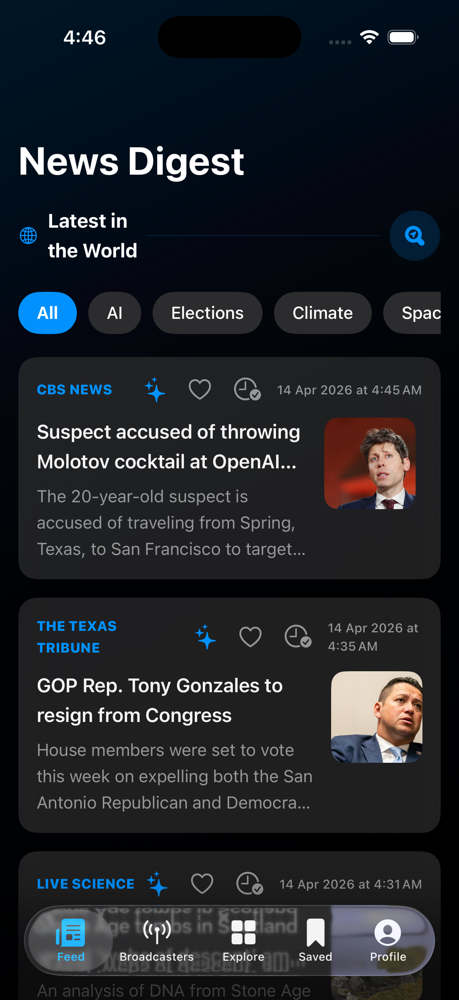
  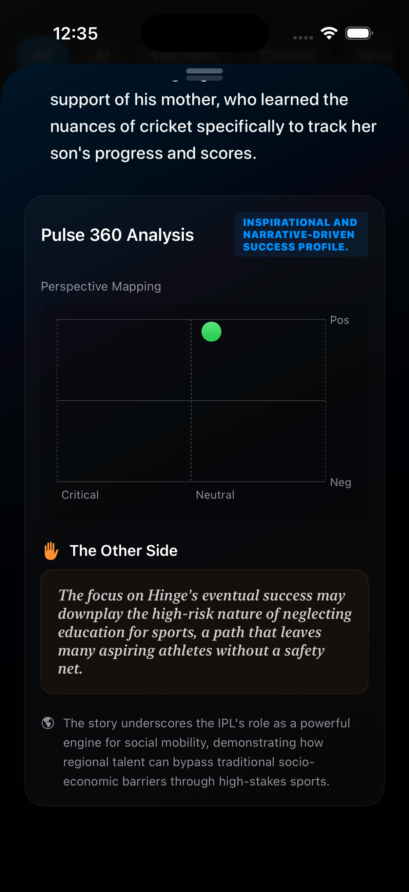
  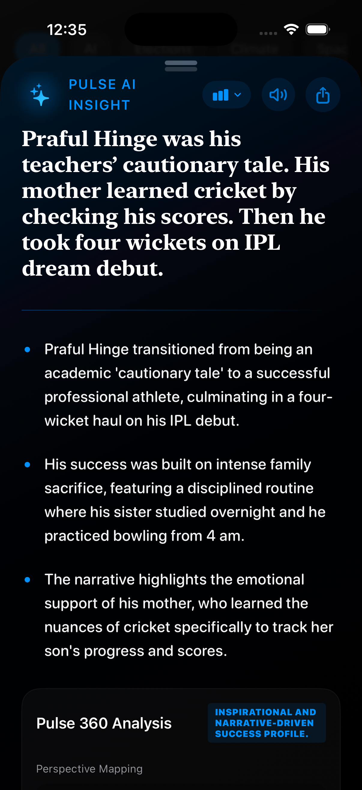
</p>

---

## 🌟 Key Features

*   **AI Pulse 360**: Gain deeper insights with automated sentiment analysis, bias detection, and global impact evaluation for every story.
*   **Audio Briefing Personas**: Listen to your news with high-fidelity AI anchors, customizable to your preference.
*   **Resilient AI Engine**: Intelligent model rotation and fallback mechanisms ensure consistent performance even under heavy API usage.
*   **Privacy-First Architecture**: Secure on-device storage and keychain integration for absolute data safety.
*   **Premium UX**: Smooth animations, haptic feedback, and a refined design system built entirely in SwiftUI.

---

## 🛠 Tech Stack

- **UI Framework**: SwiftUI
- **AI Integration**: Google Gemini API (Pro/Flash/Lite)
- **News Data**: GNews Global Feed
- **Concurrency**: Swift Structured Concurrency (Async/Await)
- **Networking**: Combine & URLSession
- **Persistence**: Actor-based File Storage & Keychain Services

---

## 📁 Repository Structure

```text
NewsDigest/
├── App/                # Main Entry Point & App Lifecycle
├── Core/               # Shared Models, Constants, and Configuration
├── Features/           # Modularized UI Features (Views & ViewModels)
│   └── Shared/         # Reusable UI Components
├── Services/           # Core Logic (AI, Networking, Auth, Audio)
├── Resources/          # Assets, Fonts, and Localization
└── Utilities/          # Extensions and Global Helpers
Tests/                  # Unit & UI Testing Suites (Root Level)
```

---

## 🚀 Getting Started

### 1. Prerequisites
- **Xcode 16.0+**
- **iOS 17.0+**
- **Google AI Studio Key** ([Get one here](https://aistudio.google.com/))
- **GNews API Key** ([Get one here](https://gnews.io/))

### 2. Installation
```bash
git clone https://github.com/dp-labs/NewsDigest.git
cd NewsDigest
```

### 3. Environment Configuration
For security, API keys are managed via `Secrets.plist`. 
- Navigate to `NewsDigest/Resources/`
- Duplicate `Secrets.plist.example` and name it `Secrets.plist`.
- Enter your API keys in the dictionary:
```xml
<dict>
    <key>GEMINI_API_KEY</key>
    <string>YOUR_KEY_HERE</string>
    <key>GNEWS_API_KEY</key>
    <string>YOUR_KEY_HERE</string>
</dict>
```

### 4. Build & Run
Open `NewsDigest.xcodeproj` in Xcode and press `Cmd + R` to run on a simulator or device.

---

## 🛡 Security & Safety

- **Zero Secret Leakage**: `Secrets.plist` is strictly ignored by version control.
- **Data Integrity**: All network requests are handled via secure SSL pinning and modern concurrency patterns.

---

## 🤝 Contributing

We welcome contributions! Please see our [CONTRIBUTING.md](CONTRIBUTING.md) for guidelines on how to get started.

---

## 📄 License

This project is licensed under the MIT License - see the [LICENSE](LICENSE) file for details.

## 📸 Screenshot Gallery

<details>
<summary>View More Screenshots</summary>

### Authentication & Onboarding
<p align="center">
  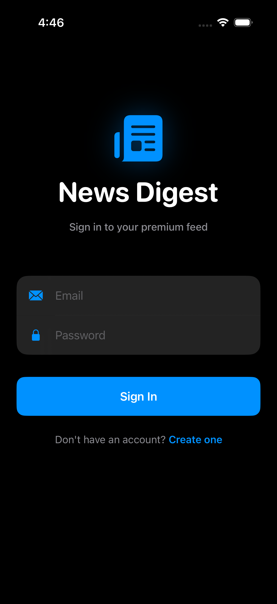
  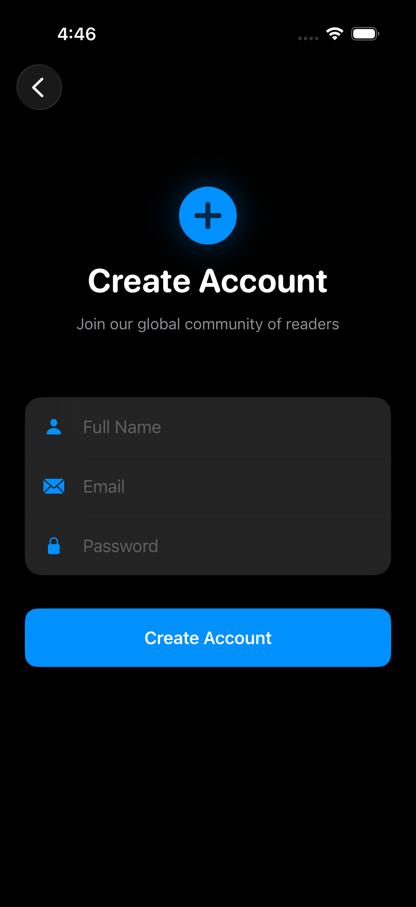
  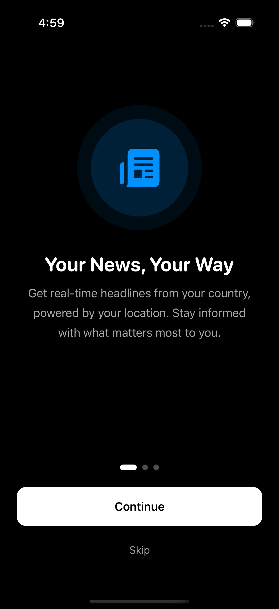
</p>

### Explore & Features
<p align="center">
  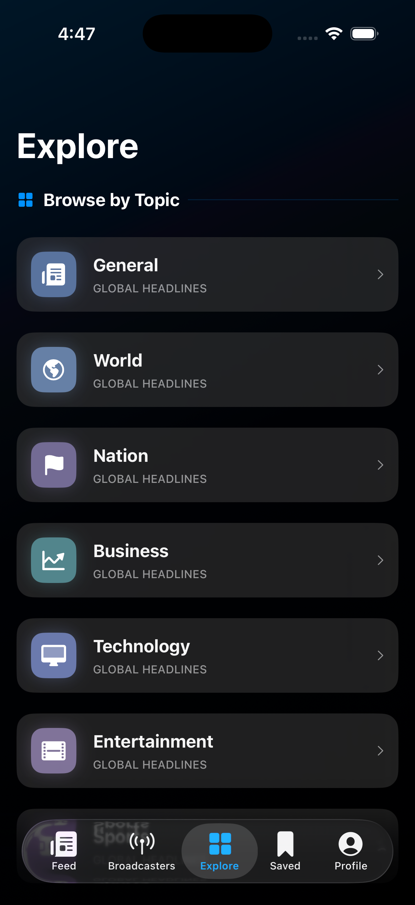
  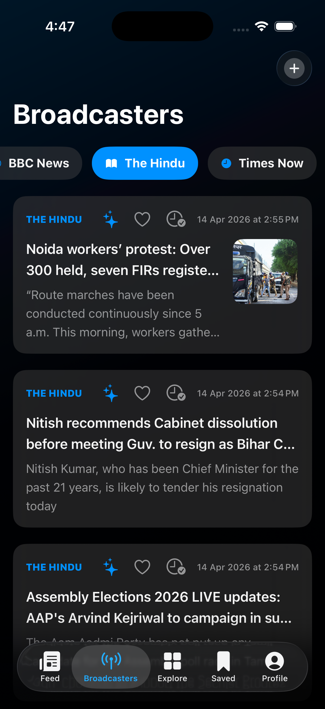
  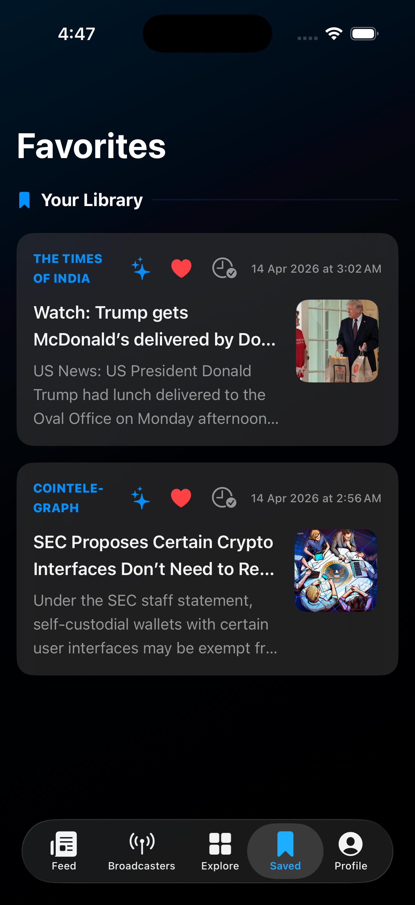
</p>

### Insights & Profile
<p align="center">
  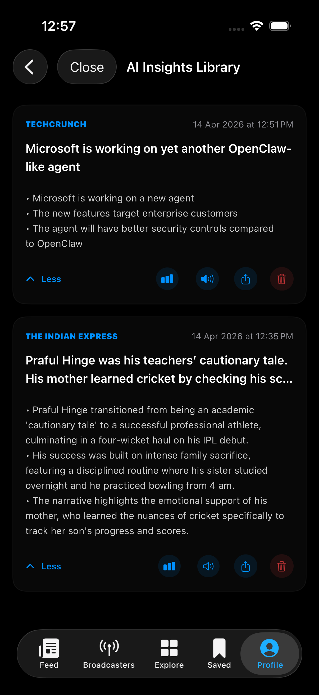
  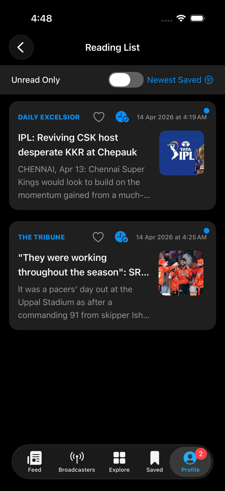
  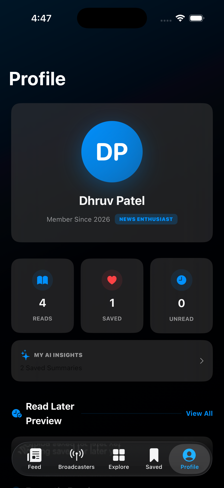
</p>

</details>

---

## 👨‍💻 Author

**Dhruv Patel**  
iOS Developer & Open Source Enthusiast

[](https://www.linkedin.com/in/dhruvpatel59/)
[](https://github.com/dhruvpatel59)

*Crafted with excellence by [Dhruv Patel](https://github.com/dhruvpatel59)*
